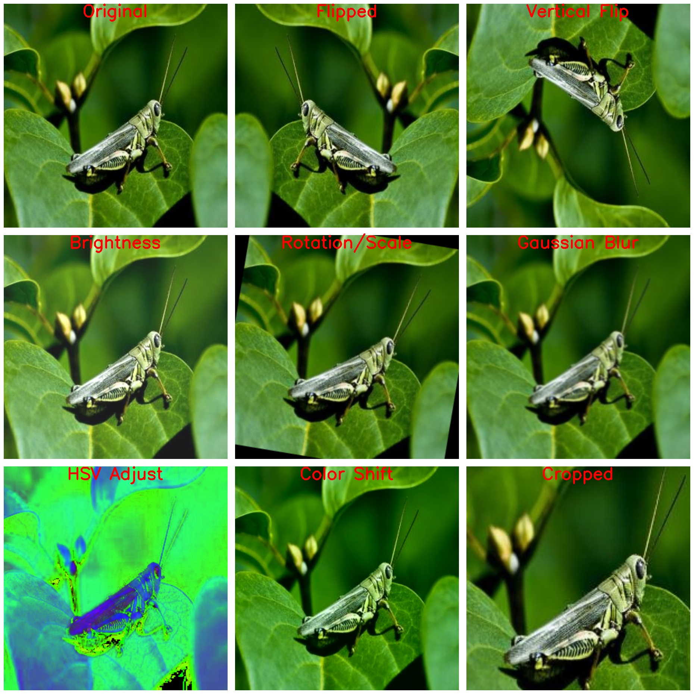
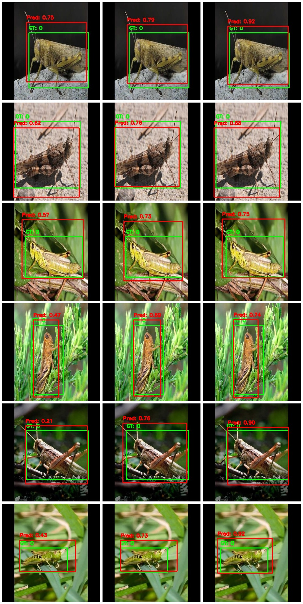

# 🚀 HHO-Based Fusion of YOLOv5 & YOLOv8 for Enhanced Locust Detection
🔍 A deep learning–based object detection model for locust identification using an HHO-optimized fusion of YOLOv5 and YOLOv8.

## 📌 Project Overview
This is the official repository for my research work:

"HHO-Based Fusion of YOLOv5 and YOLOv8 for Enhanced Locust Detection" (DOI: 10.5281/zenodo.14996737)

This study proposes a Harris Hawks Optimization (HHO)–based fusion framework that combines the strengths of YOLOv5 and YOLOv8 for accurate and efficient locust identification.
The dataset has been curated, annotated, and augmented specifically for this task.
This repository presents the implementation, fusion process, and performance evaluation of the proposed HHO-based fused YOLOv5–YOLOv8 model for real-world locust identification in smart farming applications. The study was conducted on:

1️⃣ A curated dataset specifically prepared for locust detection.

2️⃣ An augmented version of the dataset, where various augmentation techniques were applied to enhance model robustness.

3️⃣ Labels are in YOLO format.

## 🔥 Key Findings:
◆ The HHO-based fused model achieved a higher Mean IoU and better detection accuracy compared to individual YOLO models.

◆ The fusion reduced false positives and improved overall model robustness under varied lighting and environmental conditions.

◆ The fusion strategy effectively leveraged YOLOv5’s localization precision and YOLOv8’s generalization capability.

## ✅ Features
★ YOLOv5 + YOLOv8 fusion using Harris Hawks Optimization (HHO)

★ Curated and augmented dataset for locust detection

★ Training and inference scripts included

★ Fusion and evaluation scripts for HHO-based ensemble

★ Supports Google Colab for easy execution

## 📁 Dataset & Model Files
🔹 Code includes:

YOLOv5 and YOLOv8 base training scripts

HHO-based fusion implementation (fusion_hho.ipynb)

Inference and visualization utilities


🔹 Dataset is structured like this
```
locust_detection
├── images
│ ├── train
│ │ ├── img_001.jpg
│ │ ├── img_002.jpg
│ │ └── ...
│ ├── val
│ │ ├── img_101.jpg
│ │ ├── img_102.jpg
│ │ └── ...
└── labels
├── train
│ ├── img_001.txt
│ ├── img_002.txt
│ └── ...
├── val
│ ├── img_101.txt
│ ├── img_102.txt
│ └── ...
```
## 🎯 Augmentation Techniques Applied

The following augmentation techniques were applied to improve model diversity and robustness:

🔹 Horizontal & Vertical Flip

🔹 Brightness and Contrast Adjustment

🔹 Rotation and Scaling

🔹 Gaussian Blur

🔹 HSV Modification

🔹 Color Shifting

🔹 Cropping

💡 Augmentation script: augmentation.ipynb

### **Applied Augmentation Techniques**


📸 Sample Output



